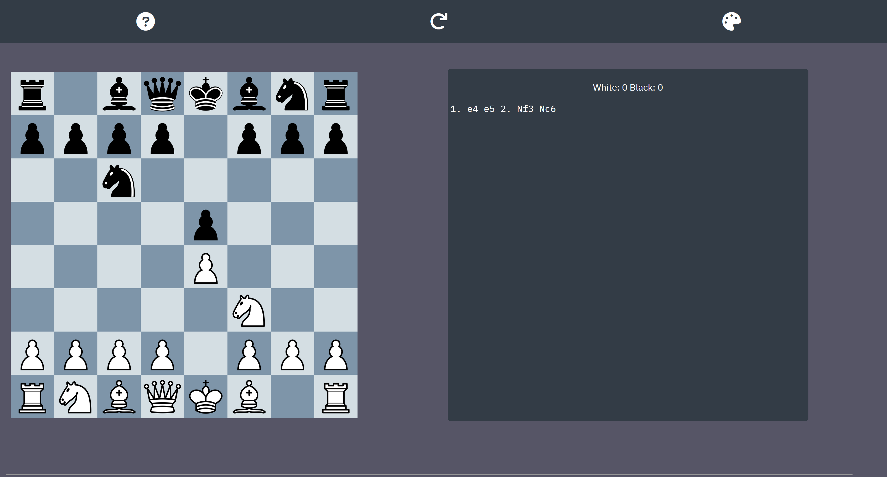

# Chess

# Project Overview

Chess as a game has been around since the 6th century and attracts players of any age, gender, or background, due to its easy-to-understand rules and deep strategic complexity.  

The purpose of this project is to provide a simple, browser-based tool for two players to play a game against each other, with none of the usual pressures of playing online (eg. rating).  

The beauty of chess lies in the fact that it can be as easy or difficult as you want - two beginners throwing pieces around may get as much satisfaction or enjoyment as two Grandmasters at the very top level playing the most important game of their lives. This is what the project aims to achieve - anyone at any level can enjoy using the site.

# Table of Content

[to implement]

# Planning Stage

## Target Audience

- Adults and children who do not regularly play chess but want a way to pass some time;
- More involved chess players who want a break from competitive play;
- Players looking for an easy way to introduce friends or family to the game.

## User Stories

As a user, I want to:

- play chess in-browser with a friend or family member.
- be able to customise the experience in a way that suits me (eg. colour themes).
- see a list of moves played and be able to cycle through them.
- see an updating count of what pieces have been taken.
- see who won and lost the game and track score.
- learn the rules of chess before I play.

## Site Aims

- To provide a free way to play chess against a friend or family member without owning a physical board;
- To be simple and easy to navigate and play;
- To provide full functionality of game history;
- To explain the rules of chess to those who need it;
- To be fully accessible and have options to change the colour scheme of the website and board area;
- Provide a session score tracker;
- To be enjoyable to players of all levels.

## How This Will Be Achieved

- The game will be entirely browser-based, requiring no downloads, sign ups, or payment;
- The project will be a single-page application (SPA), with a togglable pop-up for rules explanations;
- The site will be able to programmatically change its colour scheme based on user input;
- The site will have an area to display the previous moves in the current game and arrow buttons to cycle through the moves;
- The site will store the amount of games in the session, and track which player played with which colour each game;
- The site will display the amount of session wins for each player.

# Design Stage

## Colour Palette

I decided to use a dark colour theme for this project, using blue-greys (#565566 and #333c46) for background elements and white text. The chess board itself will have different colour schemes to choose from, with the default being an icy blue to match the rest of the site.

## Fonts

The font I will be using is IBM Plex Sans, with IBM Plex Mono used for displaying the game PGN (portable game notation, how the history of the game will be displayed). IBM Plex Sans is a simple sans serif font with a slightly modern feel to it, which matches well with the dark colour scheme I've chosen. I'm using a monospace font for the PGN because it makes it easier to read and parse long strings of non-english text.

# Development Stage

## Game Logic

Being a chess client, the most important part of the project was the game logic. This included setting up a digital representation of the board, finding valid moves for each different type of piece, and determing game end conditions like checkmate, stalemate, and other draw conditions.  

## Code Architecture

The board was represented by a two-dimensional array, with piece objects inside that array (and undefined values to represent empty squares). The project is object oriented, with each different piece class (eg. King, Queen) inheriting from a generic Piece class. The board and game itself are also objects.  

Part way through the project, I decided to implement an MVC (model-view-controller) architecture. The benefits of this architecture lie in the separation of logic - how the program implements the game is kept entirely separate from how it is displayed in the browser. This makes the code inherently reusable - it's essentially a plug & play system, where the backend can be plugged into any front end implementation (to give an out-there example, it could work with a VR game).  

This however was never implemented fully - while the logic is mostly separated, there is some view logic inside what should be the controller. Had I had more time or were to restart the project, I would keep the MVC architecture in mind from the start to avoid this.

# Site Features

The site is designed to be a single page application, will all information needed to play displayed on the screen at once. The header consists of three buttons - one to open a "how to play" modal, one to reset the board, and one to open a modal to change the colour scheme of the board.  

Below the header is the chessboard, which is the most prominent element on the site. This displays the state of the game and allows the user to interact with the site. Next to the board (or beneath it on smaller screens) is an info section, which displays the session score for white and black, and displays the game history in PGN format.

## How to Play

The how to play modal contains information for new players, including how the pieces move, how the game ends, and supplementary material published by [chess.com](chess.com).

## Colour Customisation

The colour scheme button allows the user to edit the colours of the chessboard. It opens a modal displaying a preview of each colour scheme.

## Reset Button

The reset button ends the current game and starts a new one, moving all pieces back to their starting squares and clearing the game history.

## Score Counter

The session score counter displays the score for each colour in the current site session. It increments by 1 when a player wins a game, and 0.5 for each colour for a draw.

## Moving Pieces

As this game is geared towards casual players or those less familiar with chess, I decided to have valid moves for a selected piece be highlighted. The piece is selected simply by clicking or tapping on it.

The piece can then be moved by clicking or tapping on one of the highlighted squares. If a different piece is clicked, the old piece will be deselected and the moves for the new piece highlighted. If an empty square or a square containing a piece of the wrong colour is clicked, the piece will be deselected and the highlights removed.  

Once the piece is moved, the board is updated to reflect its new position and the move is recorded in the game history, and it is then the other player's turn to move.

## Checkmate

The way to win a game of chess is by placing your opponent in checkmate - ie., they are in check and there is nothing they can do to prevent their king from being captured on the next turn. When this occurs, an alert is displayed to the user, the session score counter updates, and the game resets.

## Other Game End Conditions

A game can end in a draw in a number of ways. If a position is repeated three times throughout the game, if a player has no valid moves but is not in check, or if 50 moves pass without a pawn moving or a capture taking place, the game ends in a draw. When this happens, the same procedure as checkmate is followed, except the alert specifies which type of draw occured.

## Captures

When a piece can move into the same square as an enemy piece, that piece is captured and removed from the board.

# Testing

The code was tested manually throughout the project, helping massively with finding and fixing bugs.

## Bugs

There were a number of bugs that cropped up during the development process.

- When castling, valid moves would be displayed as if the pieces were in their original position.
    - I realised this was because I had updated the board to display pieces in their correct position and could be selected, but hadn't updated the objects properties to reflect its new coordinates, which is what is used to determine valid moves.
    - Once I had updated the code to properly update the objects, castling worked as expected.
- When implementing the 50 move rule for draws (no pawn move or capture in the last 50 moves), I realised that moving a knight on the first move caused the game to end in a draw.
    - This was because I didn't have logic to check if the game hadn't been more than 50 moves - the algorithm simply ened up looking at the entire game, seeing no pawn moves or captures had been made, and declaring the game a draw.
    - I added a simple if statement to check that the game had been at least 50 moves long and moved the logic inside of that, which fixed the issue.
- Background images for squares with pieces didn't display on the deployed site.
    - This was because I used filepaths relative to the JavaScript file, where the URLs were being set programmatically. It didn't occur to me that because the files would be looked up by the HTML file, the paths should be relative to that.
    - After removing ../ from the beginning of each URL, the site functioned as expected.
- I ran into issues with the way arrays are implemented, in particular with the logic to see if making a certain move would put either player in check - as they are passed by reference rather than value, making a change to an array I thought was only a copy also changed the original array.
    - I fixed this by creating deep copies with the map function, allowing me to make changes without affecting the original.
- In the algorithm to look for checks, it would call the getValidMoves function for each enemy piece to determine whether the king could be captured by it. The problem was that the getValidMoves function also called the function to look for checks, leading to an infinitely recursing loop.
    - To fix this, I added an optional parameter to the getValidMoves functions called lookForChecks that would default to true and some basic selection logic, but when called from the algorithm to find checks I could pass in false, meaning it would not recurse.